# Retail BI - Power BI Reporting Application

Учебный проект курса **Business Intelligence Applications** (TH Nürnberg, WiSe 2025/26, оценка **1.7 / Good**).

Полноценное отчётное приложение на Power BI для анализа продаж розничной компании, работающей в трёх странах (USA, Germany, Canada). Включает автоматизированный ETL, звёздную схему, DAX time-intelligence меры и 5 интерактивных аналитических страниц.

> Автор: Алёна Фадеева ([@piece-of-infinity](https://github.com/piece-of-infinity))
> Связаться: [email](mailto:fadeeva.alenafad@gmail.com) · [Telegram](https://t.me/piece_of_infinity)

---

## Что внутри

- **Автоматизированный ETL через Power Query**: загрузка CSV/XLS, очистка, стандартизация типов, транспонирование, обработка ZIP/postal codes (numeric для USA/Germany, alphanumeric для Canada), append таблиц трёх стран в единую fact-таблицу.
- **Star schema** с fact-таблицей `Sales_all_countries` и dimension-таблицами `Product`, `Manufacturer`, `Geo`, `DateTable`. Связи many-to-one от dimensions к фактам.
- **DAX-меры**: `Total Realized Revenue`, `Total Realized Revenue YTD`, `Total Possible Revenue`, `Total Possible Revenue YTD`, `Realized Revenue YOY`, `Realized Revenue YOY %`, `Realized Revenue YoY Absolute`, `Revenue gap`, `Possible Revenue`.
- **5 страниц отчёта**: How-to, Overview (Country & Category), City Finder, City Analysis (Q2–Q3), City Analysis 2017 - drill-through (Q4–Q7).
- **Визуалы**: bar charts, line charts, cards, map visuals (geographic distribution по ZIP), waterfall chart (YoY breakdown по производителям), AppSource Bullet Chart by OKViz (realized vs possible revenue), slicers, bookmarks для воспроизведения предзаданных аналитических состояний, drill-through для перехода в детальный анализ конкретного города.

## Бизнес-задача

Анализ продаж международной компании. Ключевые вопросы, на которые отвечает приложение:

1. **Q1**: Какой город вне США показал максимальную реализованную выручку?
2. **Q2**: Какова накопленная реализованная выручка с января по май 2017 в найденном городе?
3. **Q3**: Какова возможная выручка и revenue gap в том же периоде?
4. **Q4**: Топ-3 категории продуктов в выбранном городе в 2017?
5. **Q5**: ZIP-код с максимальной реализованной выручкой?
6. **Q6**: Изменение выручки 2016 → 2017 в разрезе производителей (waterfall)?
7. **Q7**: Сравнение realized vs possible revenue через нестандартный визуал (AppSource Bullet Chart)?

Для каждого вопроса сохранена закладка (bookmark) - гарантирует воспроизводимость аналитики.

## Скриншоты

### Обзор страниц отчёта
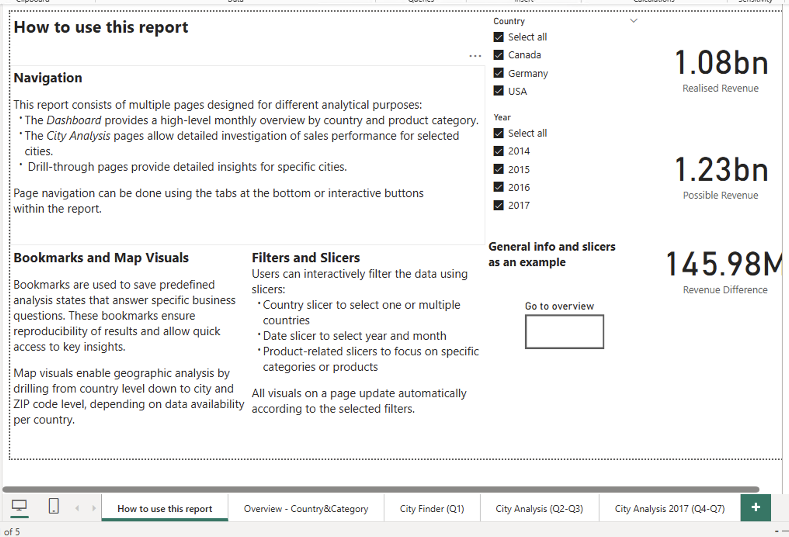

### Overview Dashboard - Country & Category
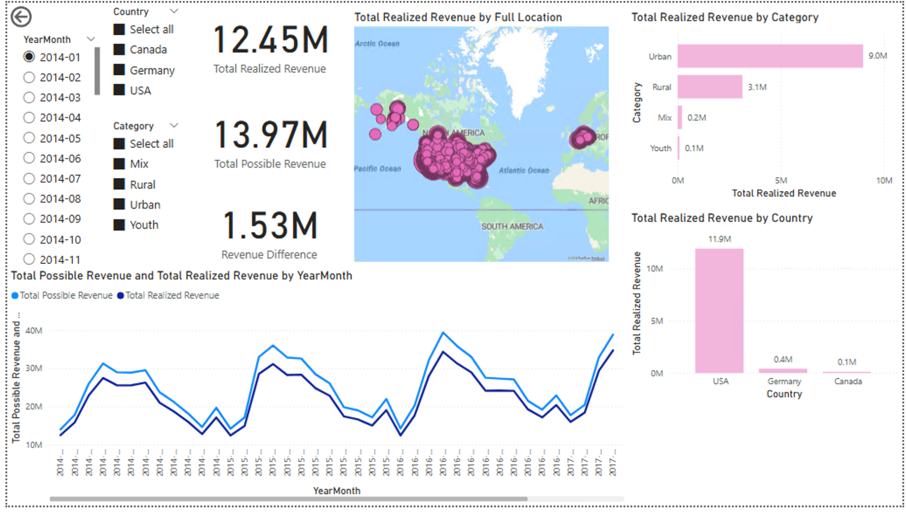

### Star schema
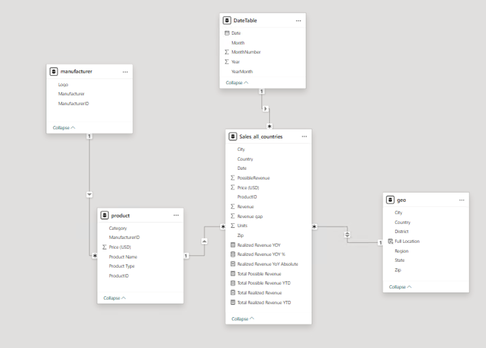

### DAX-меры
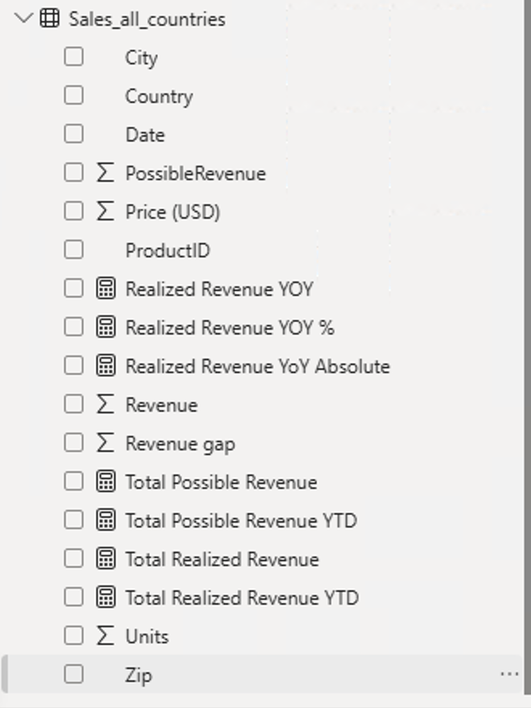

### City Finder (Q1)
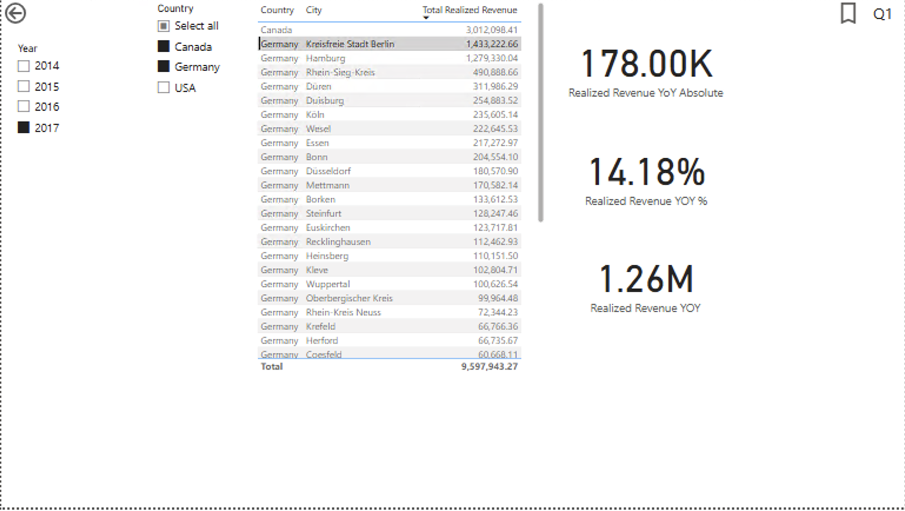

### City Analysis (Q2–Q3)
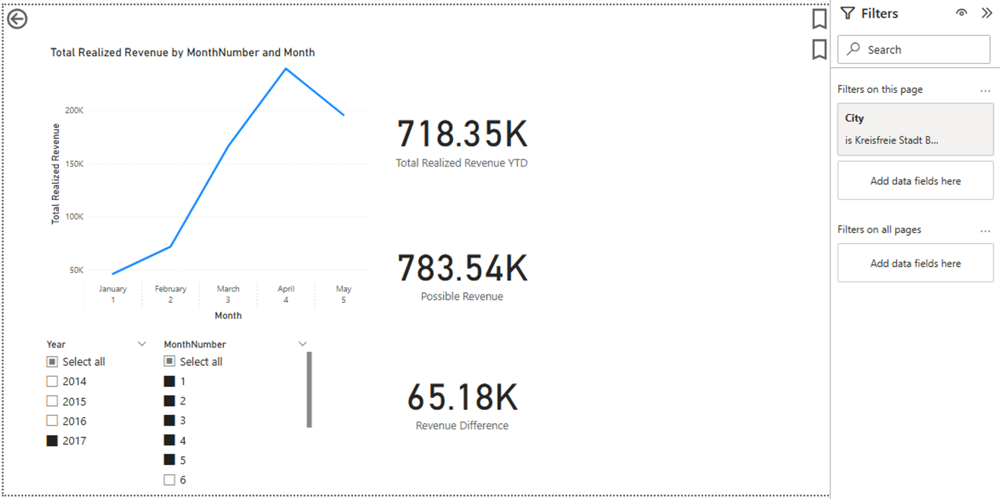

### City Analysis 2017 - Drill-through (Q4–Q7)
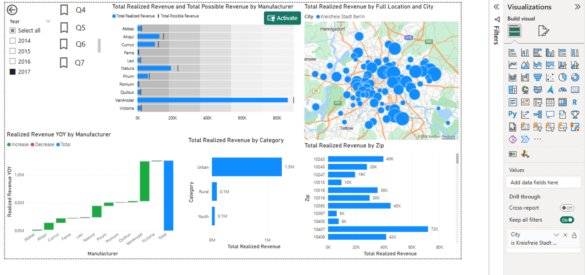

### ZIP-level revenue (закладка Q5)
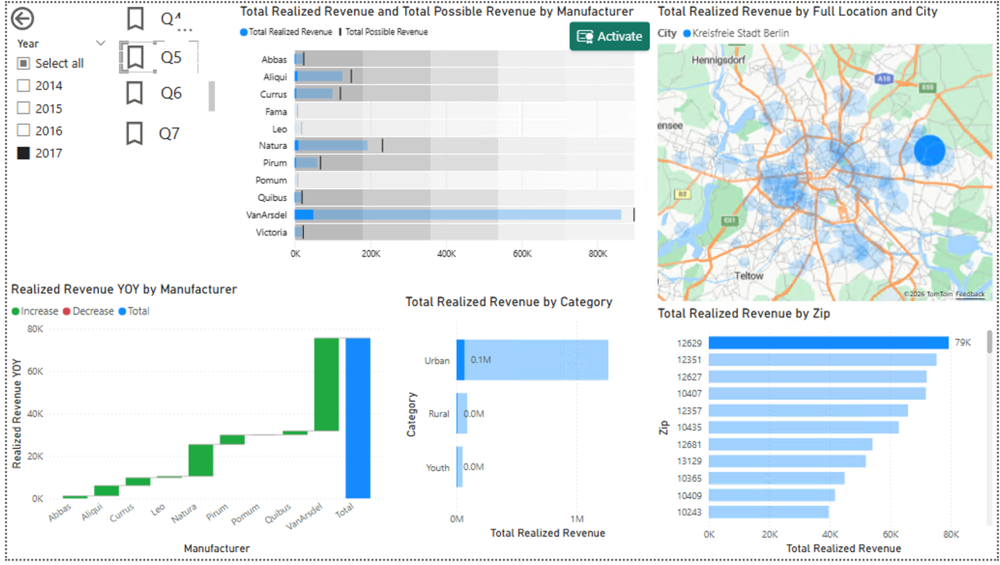

### How-to page
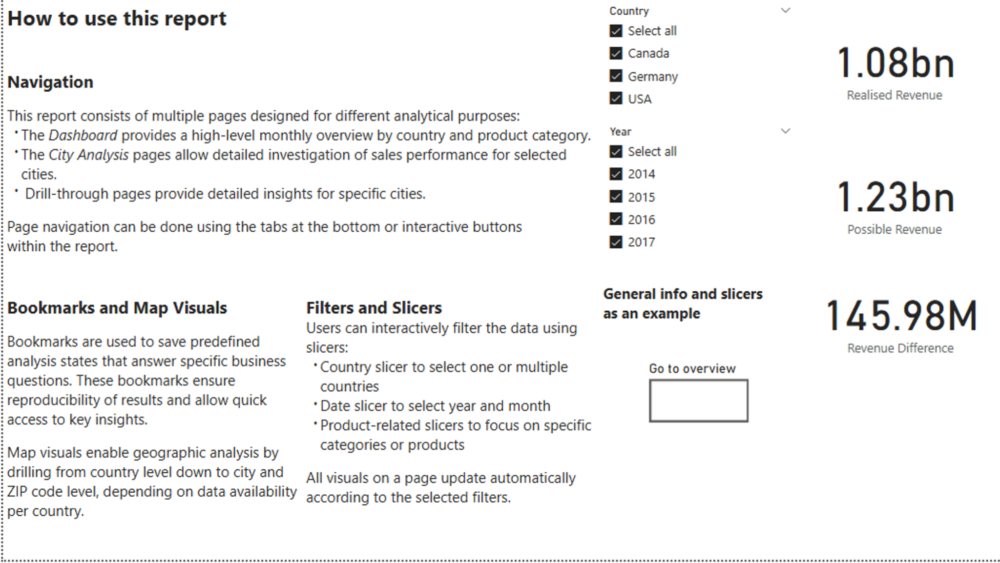

### Power Query - raw source files
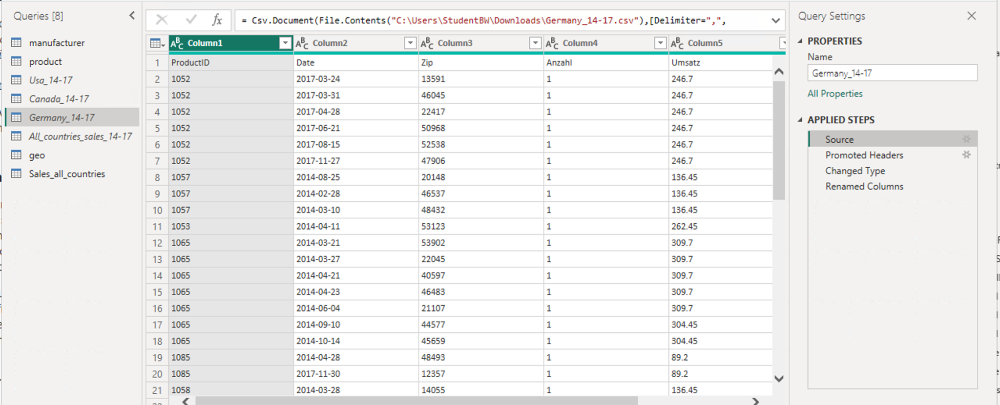

### Append всех стран в один fact
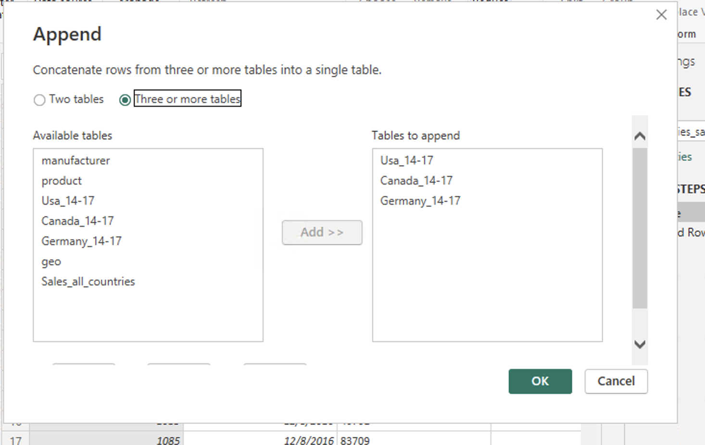

## Структура репозитория

```
retail-bi-powerbi/
├── README.md
├── retail_bi.pbix        # сам Power BI-проект (15 МБ)
├── docs/
│   └── Documentation.pdf          # полная документация (English): ETL, схема данных, меры, страницы
└── images/                        # скриншоты из документации
```

## Как открыть

1. Скачайте `retail_bi.pbix` (или склонируйте репозиторий).
2. Откройте в **Power BI Desktop** (Windows). Бесплатная установка: [powerbi.microsoft.com/desktop](https://powerbi.microsoft.com/desktop/).
3. Полная документация со скриншотами и обоснованием решений - `docs/Documentation.pdf`.

> Сырые данные в репо не публикуются (учебный кейс), но все трансформации детально описаны в документации и воспроизводимы.

## Что показывает этот проект

- Работа с разнородными источниками (CSV + XLS) и приведение их к единой модели.
- ETL без модификации исходных файлов - все шаги в Power Query, поддерживает refresh.
- Понимание звёздной схемы и one-to-many связей.
- DAX time-intelligence (`YTD`, `YOY`, `SAMEPERIODLASTYEAR`).
- Аналитическое мышление: декомпозиция бизнес-вопросов на конкретные страницы и закладки.
- UX отчёта: How-to page, навигация, drill-through, переиспользуемые bookmarks.

## Стек

`Power BI Desktop` · `Power Query (M)` · `DAX` · `Star schema design`

## Лицензия

Учебный проект, представлен в портфельных целях. Код DAX-мер и логика модели - свободны для повторного использования. Исходные данные не распространяются.
